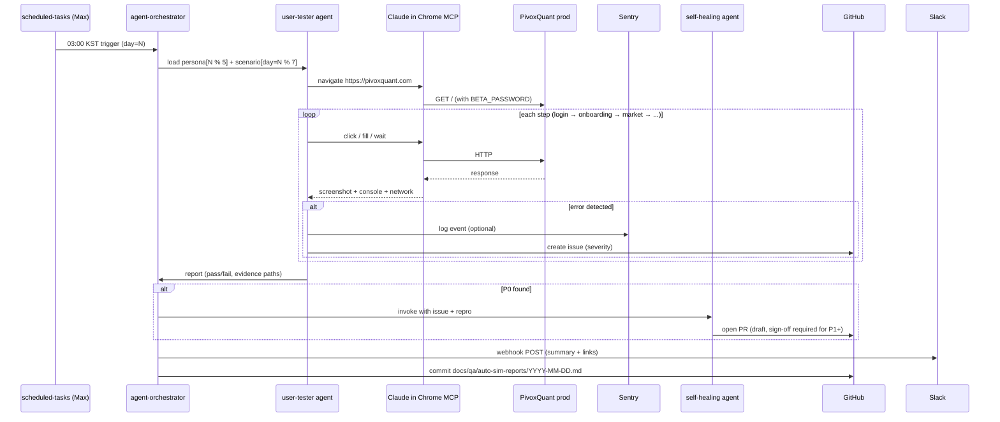

# Continuous Autonomous User Simulation (CAUS) — PivoxQuant

**Status**: DRAFT v1 — CEO 의사결정 대기
**Owner**: 배상현 (CEO) / Product
**Author**: Product Agent
**Date**: 2026-05-13
**Tag**: [BIZ+CODE]
**Spec path**: `docs/specs/continuous-user-sim-spec.md`

---

## TL;DR

AI 에이전트(Claude)가 5–10명의 가상 페르소나를 운영하며 1주일 동안 PivoxQuant를
"진짜 유저처럼" 매일 다른 시나리오로 사용한다. 사장님이 잠든 새벽에 cron이 도는
동안 회귀/UX/런타임 에러를 자동 발견 → Slack 알림 → P0면 self-healing이 자동 PR.

**핵심 룰**: 추가 비용 0원. Max 플랜 + Claude in Chrome MCP + 기존 user-tester /
self-healing agent + Slack webhook + Sentry free tier 만 사용. Anthropic API 별도
크레딧 / GitHub Actions 유료 분 / 신규 SaaS 일체 금지.

CEO 원문: *"그런 기능도 되냐 실제로 너가 유저 넣고 한 1주일이나 그렇게
테스트해보는 거야"* — 답: **된다, 추가 비용 0원으로 가능**.

---

## 1. 목적 + Success Metrics

### 목적 (Why)
- **인간 베타테스터 onboarding 전에** 실사용 시나리오 회귀를 자동으로 잡는다.
- 사장님 1인 창업 구조 한계 극복 — 수동 QA가 daily 불가능, AI 시뮬이 24/7 대체.
- "verify-ux 같은 1회성 sweep" 이 아닌 **continuous** 운영 (매일 cron).
- v31 마라톤 세션 패턴(자율 야간) 활용 — 사장님이 자는 동안 가치 누적.

### 타깃 유저
- **Primary**: PivoxQuant CEO (배상현) — daily Slack 알림으로 회귀 인지
- **Secondary**: 향후 합류할 인간 베타테스터 (CAUS가 sweep 끝낸 페이지부터 노출)

### Success Metrics

| 지표 | Primary / Secondary | 목표 (Phase 1, 1주) | Failure signal |
|------|----|---------------------|----------------|
| 일일 시뮬 성공률 (시나리오 완주) | Primary | ≥ 85% | < 50% → 시나리오 simplify |
| P0 회귀 자동 발견 건수 (주간) | Primary | ≥ 1건 발견 | 0건 7일 연속 → 시나리오 다양화 부족 |
| Slack 알림 → 사장님 인지 latency | Primary | ≤ 1h (휴대폰 알림) | webhook 깨짐 |
| Self-healing 자동 PR 정확도 | Secondary | ≥ 60% (사장님 merge 비율) | < 30% → 룰 강화 |
| Token quota 사용량 (Max 5h window) | Secondary | ≤ 50% (안전 마진) | > 80% → 시나리오 분산 |
| 시뮬 user 누적 페이지 커버리지 | Secondary | 9개 핵심 페이지 7일 내 전부 hit | 미달 → routing prompt 보강 |
| Production analytics 오염도 | Secondary | < 5% (User-Agent 필터링) | > 10% → markup 강화 |

### 안티-목표 (Out of Scope, v1)
- Visual regression pixel diff (Phase 3로 미룸)
- 실제 결제 발생 (Stripe test mode 한정)
- 성능 / Lighthouse 자동 측정 (Phase 3)
- Multi-region 시뮬 (한국 IP 한정 v1)
- 보안 침투 테스트 (별도 `cso` skill 영역)

---

## 2. Problem Statement

### Who
- 1인 창업자 PivoxQuant CEO. 베타 출시 임박, 인간 베타테스터 미초청.
- v40 carry-over에서 verify-ux 자동화 시도했으나 OAuth bypass(DEV_LOGIN_SECRET)
  미설정으로 차단된 적 있음.

### What (현재 통증)
1. **회귀 발견이 reactive**: 사장님이 직접 클릭해야 깨진 페이지 보임.
2. **bug-hunter agent는 정적 분석 + 1회성**: continuous 운영 불가.
3. **인간 베타테스터 invite하면 first impression 깨짐** — 첫 P0 버그가 진짜
   user 손에서 터지면 신뢰 회복 어려움.
4. **v31 자율 야간 세션 패턴**: 사장님이 자는 시간 8시간이 "비어 있음".

### Why now
- 베타 password / Vercel deploy / Railway prod 모두 살아있음 — 시뮬할 surface 존재.
- Max 플랜 5h window 야간엔 거의 안 씀 → token 여유.
- §101 면제 트랙 출시 임박 (regulatory_changes_2026-05.md), 출시 직전 회귀 sweep 필수.

### Evidence
- v30/v31 세션: 18+ PR squash-merge 후에도 매 wave마다 P0 1–2건씩 발견됨.
  사람이 매번 클릭 못 했음 → automation 필요성 확정.
- `feedback_no_false_reports.md`: agent 결과 forward 금지 = **실제 브라우저 실행 증거**
  필요. CAUS가 screenshot + console log + network log를 produce.
- v39 GitHub Actions billing 차단 → cron 인프라 단절. scheduled-tasks(Max 플랜)로
  대체해야 함 (실제 v40 carry-over에서 활성됨, 활용도 0%).

---

## 3. Solution (Core)

### Core
**Claude Code scheduled-tasks**가 매일 03:00 KST에 `user-tester` agent를
호출 → agent가 **Claude in Chrome MCP**로 prod 브라우저를 그날의 시나리오대로
운전 → 모든 단계에서 screenshot / console / network 로그 수집 →
이슈 발견 시 GitHub issue 생성 + Slack webhook 알림 → P0이면
`bkit:self-healing` agent로 root cause 분석 + 자동 PR.

### UX Flow (사장님 입장)
1. **저녁 11시**: 사장님 노트북 닫음.
2. **새벽 03:00**: scheduled-task가 ticking.
3. **03:00–04:30**: agent가 5개 가상 페르소나로 시나리오 1주차 Day N 실행.
4. **04:30**: 누적 리포트 → `docs/qa/auto-sim-reports/YYYY-MM-DD.md` 저장.
5. **04:31**: Slack #pivoxquant-alerts 채널에 요약 (✅ 통과 / ⚠️ N issues / 🔥 P0 N건).
6. **아침 09:00**: 사장님 휴대폰 알림 보고 일과 시작.

### Edge Cases
- **Railway prod 다운**: 시뮬 첫 단계(`/api/health`)에서 fail → 알림만, 자동 PR 안 함.
- **Claude in Chrome MCP 세션 만료**: 재인증 필요 → Slack에 "Action required" 알림.
- **시나리오 mid-fail**: 그 시점 screenshot + 직전 5 step 로그만 저장 → 다음 step 건너뛰고 계속.
- **베타 password 변경**: `BETA_PASSWORD` env Railway에서 fetch (Vercel rotate 대비).
- **OAuth bypass 미설정**: dev-login fallback 없으면 시뮬 abort + 알림.

---

## 4. 기존 자산 활용 (추가 비용 0원 룰)

| 자산 | 역할 | 비용 |
|------|------|------|
| **Claude Code Max 플랜 scheduled-tasks** | Cron 트리거 (GitHub Actions 대체) | $0 (포함됨) |
| **Claude in Chrome MCP** | 라이브 브라우저 조작 (네비/클릭/입력/스크린샷) | $0 |
| **`user-tester` agent** | "Goldman Sachs 회장이 직접 앱 써보듯" 시나리오 검증 | $0 |
| **`bkit:self-healing` agent** | P0 발견 시 root cause 분석 + auto PR | $0 |
| **Slack webhook** (`slack-bridge` skill) | 모바일 알림 (free webhook) | $0 |
| **Sentry free tier** | 런타임 에러 수집 (5K events/month) | $0 |
| **Railway production** | 시뮬 대상 surface | 기존 |
| **Stripe test mode keys** | 결제 시나리오 (실 결제 0원) | $0 |
| **`bkit:btw` skill** | 시뮬 중 발견된 nit를 backlog로 자동 적재 | $0 |
| **GitHub free** | issue / PR / 로그 storage | $0 |

**비활성 (금지)**:
- ❌ GitHub Actions paid minutes (v39 billing 차단)
- ❌ Anthropic API standalone credit
- ❌ Percy / Chromatic / BrowserStack 등 visual regression SaaS
- ❌ 신규 cron-as-a-service (cron-job.org 외부 의존 금지)

---

## 5. 시뮬 user 라이프사이클 (1주일 시나리오)

페르소나 5명을 1주일 라운드로 운영. **하루 1명 → 7일 라운드로빈 + 매일 모든
핵심 페이지 1회 hit하는 sweep user(5번째)** 별도 운영.

| Day | 시나리오 | 핵심 페이지 | API surface |
|-----|---------|------------|-------------|
| Day 0 | 가입 + 온보딩 20문항 + 투자자 유형 결정 | `/onboarding/*`, `/profile` | `POST /api/onboarding/submit`, `POST /api/auth/dev-login` |
| Day 1 | KR 종목 검색 (삼성/카카오) → 시그널 → 알림 toggle | `/market`, `/signals`, `/alerts` | `GET /api/market/kr/*`, `POST /api/alerts/toggle` |
| Day 2 | 미국 종목 (AAPL/NVDA) → 워치리스트 추가 → AI 챗 1턴 | `/discover`, `/watchlist`, `/ai` | `POST /api/watchlist`, `POST /api/ai/chat` |
| Day 3 | Portfolio 입력 → 리스크 페이지 → 시뮬레이터 | `/portfolio`, `/risk`, `/simulator` | `POST /api/portfolio/positions`, `GET /api/risk/board` |
| Day 4 | Price alert 시뮬 → push notification 확인 | `/alerts`, `/notifications` | `POST /api/alerts/trigger-test` |
| Day 5 | Brag card / Weekly memo / Earnings prebrief artifact 생성 + `/reports` 열기 | `/reports`, `/reports/[id]` | `POST /api/artifacts/generate`, `GET /api/reports` |
| Day 6 | 결제 페이지 → Stripe **test** mode → 구독 시뮬 → cancel | `/billing`, `/billing/checkout` | Stripe test webhook |
| Day 7 | Settings → 회원 탈퇴 → 데이터 삭제 (PIPA 30일 검증) | `/settings/account` | `DELETE /api/account` |

**Sweep user (병행)**: 매일 9개 핵심 페이지 (home, market, signals, discover,
watchlist, alerts, ai, risk, settings)를 단순 hit + console / network 로그만 수집.
시나리오 user보다 가볍게 (5분 이내).

### 페르소나 5명

| ID | 이름 | 나이/직업 | 거주 | 투자 성향 | 특이사항 |
|----|------|-----------|------|----------|---------|
| sim-1 | "김지훈" | 28 직장인 | 서울 | 공격적 | 모바일 위주 (PWA install 검증) |
| sim-2 | "박은영" | 52 은퇴 준비 | 부산 | 보수적 | 큰 글씨 / 접근성 검증 |
| sim-3 | "이수민" | 35 한국계 미국인 | LA | 중립 | 영어 UI / 미국 종목 위주 |
| sim-4 | "최도윤" | 41 자영업 | 대구 | 단타 | 알림 폭주 시나리오 |
| sim-5 | "sweep" | (페르소나 없음) | KR | N/A | 9개 페이지 일일 sweep 전용 |

---

## 6. 자동 시뮬 실행 메커니즘

### Trigger (Phase 1)
```
Claude Code scheduled-tasks:
  schedule: "0 3 * * *"   # 매일 03:00 KST
  command: agent-orchestrator run caus-daily --day=$((($(date +%j) - 1) % 7))
```

### Flow per Day (Mermaid)



### Persistence
- **Per-day report**: `docs/qa/auto-sim-reports/YYYY-MM-DD.md`
  - 시나리오 / 페르소나 / pass-fail / 스크린샷 paths / console / network 요약
- **Weekly digest**: `docs/qa/auto-sim-reports/weekly-WW.md` (일요일 04:00 cron)
- **Issue 라벨**: `auto-sim`, `severity:p0|p1|p2|p3`, `sim-day:N`
- **Slack channel**: `#pivoxquant-alerts` (webhook 1개, 신규 비용 0원)

---

## 7. 가짜 user 구성

### Account pool
- 10 alias (Phase 1 은 sim1 1개부터, 점진 확장). 각각:
  - `email`: `seanbae1521+sim{N}@gmail.com` (Gmail alias, 옵션 B 2026-05-13)
  - `auth`: Google OAuth 정상 흐름 (DEV_LOGIN_SECRET 사용 X — 코드 가드 M3)
  - `is_simulated`: `TRUE` (DB column, PR #351 prod 적용)
  - `User-Agent`: `Mozilla/5.0 ... PivoxQuantSim/1.0 (persona=sim-N)` markup
  - `session`: `~/.pivoxquant-sim/sessions/sim{N}.json` (CEO 로컬, gitignore)

### DB seed
- 별도 schema 없이 `users` 테이블에 `is_simulated BOOLEAN DEFAULT FALSE` 추가
  (마이그레이션 1줄, 신규 schema/tenant 분리 비용 회피)
- 각 user는 seed 시 minimal portfolio (3 holdings) + watchlist (5 tickers) 부여
- **Cleanup**: 매주 일요일 04:30 KST cron이 `is_simulated=TRUE` rows의 7일 이상
  된 로그/artifact를 truncate (user 자체는 유지, 재사용)

### Production DB 오염 격리
- **모든 analytics 쿼리**에 `WHERE is_simulated = FALSE` 필수 (lint 룰 추가 권장)
- Sentry는 `tags.user_type=sim`로 분리 → free tier event 절약 모드
- KPI 대시보드(`analytics_metrics.md` 추적분)는 sim user 완전 제외

---

## 8. 법적 / 보안 검토

| 영역 | 이슈 | 대응 | 상태 |
|------|------|------|------|
| **자본시장법** | sim user "거래" 시뮬 | read-only만, Alpaca paper / KIS read-only API, BUY/SELL 버튼 클릭 절대 X | ✅ |
| **자본시장법 (네이밍)** | sim 시나리오 prompt에 "추천/조언" 단어 | 금지어 필터 (Iron Rule 7) | ✅ |
| **PIPA** | 가짜 user PII | `.local` 도메인 + `is_simulated` 플래그 + 30일 후 로그 truncate | ✅ |
| **정통망법 §50** | sim user에 마케팅 메일 발송 X | EmailSender가 `is_simulated=TRUE` skip 가드 추가 필요 | ⚠️ TODO |
| **DEV_LOGIN_SECRET** | ~~Railway env 미설정 시 시뮬 불가~~ **차단됨** | 코드 가드 M3 (`routes/__init__.py:97–102`, 2026-05-10) — `FLASK_ENV=production` AND `DEV_LOGIN_SECRET` 동시 set 시 boot refuse. 2026-05-13 Railway redeploy 시도에서 RuntimeError 확인. **옵션 B (Gmail alias) 채택**. | 🚫 RETRACTED |
| **베타 password** | `BETA_PASSWORD` rotate (v31 C3) | Railway env에서 동적 fetch | ✅ |
| **Stripe** | 실 결제 발생 위험 | test mode key (`sk_test_*`) 강제, prod key Reject 가드 | ⚠️ 가드 추가 필요 |
| **Rate limit** | sim user가 일반 quota 잠식 | User-Agent `PivoxQuantSim/1.0` 기반 별도 bucket | ⚠️ TODO |
| **§101 면제 트랙** | 자동 시뮬이 "광고/매월 청구"로 오인? | sim user 등록은 청구 발생 안 함, 광고 surface 미접근 → 무관 | ✅ |

---

### 8.B Gmail alias OAuth (옵션 B, 2026-05-13 채택)

**채택 사유**: Q2 옵션 A (DEV_LOGIN_SECRET) 는 코드 가드 M3
(`routes/__init__.py:97–102`, 2026-05-10) 에 의해 prod boot refuse —
`FLASK_ENV=production` AND `DEV_LOGIN_SECRET` 동시 set 시 `RuntimeError`.
정상 동작 가드이며 우회할 가치보다 보안 가치가 큼 → **유지**, sim 로그인은
실제 OAuth 경로로 전환.

**Gmail alias 메커니즘**:
- Gmail 은 `user+anything@gmail.com` 형식으로 한 메일박스에서 무한 alias 사용 가능
  (Google ToS 허용, 무료, 추가 계정 생성 X)
- sim user 풀: `seanbae1521+sim1@gmail.com` ~ `seanbae1521+sim10@gmail.com` (10명)
- 각 alias 는 PivoxQuant 백엔드 입장에서 **서로 다른 user record** (email unique)
- 따라서 `users.is_simulated=TRUE` 로 표시 + Google OAuth 정상 흐름 통과

**D+0 onboarding 절차 (CEO 수동, sim user 마다 1회)**:
1. 시크릿 창에서 `https://pivoxquant.com` 접속 → BETA_PASSWORD 입력
2. Google 로그인 → 계정 추가 → `seanbae1521+sim{N}@gmail.com` 로 OAuth 가입
   (Gmail 받은편지함은 사장님 메인 계정으로 합쳐짐)
3. 온보딩 20문항 완료 (sim 별로 다른 페르소나 답변 권장 — 다양성 확보)
4. DB 에서 해당 user row 의 `is_simulated` 를 TRUE 로 update (수동 SQL 1줄,
   Phase 1 Railway psql)
5. 브라우저 cookies + session storage 를 export:
   - Claude in Chrome MCP 사용 → `mcp__Claude_in_Chrome__javascript_tool`
     로 `document.cookie` + `localStorage` 덤프
   - JSON 으로 `~/.pivoxquant-sim/sessions/sim{N}.json` 저장
6. `scripts/caus_daily_sweep.py` 가 다음 cron 부터 해당 session 자동 재사용

**Session refresh 정책**:
- Google OAuth refresh token 30일 만료 → 매월 1회 CEO 가 D+0 절차 반복
- 만료 감지: `caus_daily_sweep.py` 가 session file 의 mtime > 30일이면 Slack warn

**보안**:
- `~/.pivoxquant-sim/` 는 CEO 로컬 디스크에만 존재 (git ignore, 클라우드 sync 금지)
- 만약 노트북 분실 → sim user 10명 비밀번호 강제 reset + alias 재발급

---

## 9. 단계별 구현 (Phase)

### Phase 1 — MVP (1주 이내, ~3 PR)
**목표**: cron 1개 + persona 1명 (sim4 sweep) + Slack 알림.

- [x] DB 마이그레이션: `users.is_simulated` 컬럼 (PR #351, prod 적용 2026-05-13)
- [ ] **CEO 수동 D+0**: `seanbae1521+sim1@gmail.com` OAuth 가입 + cookies 저장 (§8.B)
- [ ] EmailSender 가드: `if user.is_simulated: return` (정통망법 안전판)
- [x] `scripts/caus_daily_sweep.py` — Phase 1 launcher (이 PR)
- [ ] Claude Code scheduled-task 등록: `caus-daily-sweep`, cron `0 18 * * *` UTC
      (= 03:00 KST), command `cd /Users/seanbae/Desktop/취준/stockpilot &&
      python3 scripts/caus_daily_sweep.py`
- [ ] Slack webhook URL 발급 → `SLACK_WEBHOOK_URL` 또는 `SLACK_WEBHOOK_CAUS` 환경변수
- [x] 결과 저장 path 확정: `docs/qa/auto-sim-reports/` (launcher 가 자동 생성)
- [ ] Smoke test: 수동으로 한 번 실행 → Slack 알림 도착 확인

**Exit criteria**: 3일 연속 자동 실행 + Slack 알림 도착 + 리포트 누적 3개.

### Phase 2 — Self-healing 연결 (2주차, ~2 PR)
- [ ] 페르소나 4명 추가 (sim-1 ~ sim-4)
- [ ] 시나리오 라이브러리 작성 (`docs/qa/scenarios/day-{0..7}.md`)
- [ ] P0 발견 → `bkit:self-healing` agent invoke
- [ ] Auto PR template: 시뮬 evidence 첨부 (screenshot + repro steps)
- [ ] Self-healing 정확도 측정 게이지 (사장님 merge 비율 추적)

### Phase 3 — 확장 (한 달 차, ~3 PR)
- [ ] Visual regression: 이전 day screenshot과 ImageMagick `compare` (무료) diff
- [ ] Lighthouse CLI (`lighthouse-ci` npm, free) → 4개 페이지 daily 점수
- [ ] 누적 dashboard (`/reports/auto-sim` 내부 페이지, public 노출 X)
- [ ] Sentry breadcrumb 추가 — sim run마다 trace ID
- [ ] Cumulative coverage matrix: 페이지 × 페르소나 × day = 어디 빈칸?

### Phase 4 — 인간 베타테스터 전환 (출시 D-day 직전)
- [ ] CAUS 7일 연속 ✅ → 인간 베타테스터 invite
- [ ] CAUS는 백그라운드 유지 (회귀 sentinel)
- [ ] 베타테스터 피드백 ↔ CAUS 시나리오 보강 (실 사용자 path 학습)

---

## 10. 리스크 + 대응

| ID | 리스크 | 영향 | 대응 |
|----|--------|------|------|
| **R-A** | sim 행동이 production analytics 오염 | KPI 왜곡 | User-Agent markup + `is_simulated` 컬럼 + analytics WHERE 필터 |
| **R-B** | FMP / KIS API quota 소진 | 실 user 영향 | sim 하루 ≤ 100 API call, cache 적극, KIS는 read-only paper |
| **R-C** | Stripe 실 결제 발생 | 비용 + 환불 분쟁 | `sk_test_*` 강제, prod key 사용 시 즉시 abort (런타임 가드) |
| **R-D** | Self-healing이 잘못 fix → 회귀 | 신뢰 손실 | P0만 자동 PR, draft 상태로 사장님 merge 대기 (`feedback_no_false_reports`) |
| **R-E** | Max 플랜 token quota 소진 | 사장님 낮 작업 차단 | 시나리오 단순화, 03:00 KST 분산 (페르소나별 03:00/04:00) |
| **R-F** | OAuth bypass secret 유출 | 프로덕션 침해 | HMAC + 5분 TTL + IP allowlist (Railway egress IP) |
| **R-G** | Claude in Chrome MCP 세션 만료 | 시뮬 무기능화 | 만료 감지 → Slack "Action required" + 다음 day skip |
| **R-H** | 7일 이상 P0 0건 → 시뮬 무가치 의심 | 자원 낭비 | 시나리오 mutation (random click 추가), heatmap 미커버 영역 우선 |
| **R-I** | 베타 password rotate 시 시뮬 차단 | 일주일치 데이터 손실 | Railway env에서 동적 fetch, hardcode 절대 X |
| **R-J** | sim user 데이터가 `users` 테이블 비대화 | 쿼리 성능 | 5 페르소나 고정 (재사용), 새로 생성 X |

---

## 11. 즉시 결정해야 할 것 (CEO 의사결정)

| # | 질문 | 옵션 A | 옵션 B | 추천 |
|---|------|--------|--------|------|
| Q1 | 시뮬 대상 환경 | **Prod** (`pivoxquant.com`) | Staging 신규 구축 | **A** (staging 구축은 추가 비용/시간, prod에 `is_simulated` 격리로 충분) |
| Q2 | sim user 로그인 방식 | ~~DEV_LOGIN_SECRET + HMAC bypass~~ **RETRACTED** | **Gmail alias OAuth (sim1~10)** | **B** ✅ 채택 (2026-05-13) |
| Q3 | 시뮬 user data 격리 | `is_simulated` 컬럼 + 같은 schema | 별도 schema/tenant | **A** (마이그레이션 1줄, 적용 완료 PR #351) |
| Q4 | 발견된 버그 처리 | P0 자동 PR + P1↓ 알림만 | 전부 알림만 | **A** (P0만 자동, 나머지는 사장님 sign-off) |
| Q5 | Phase 1 시작 시점 | **이번 주 (D+3 이내)** | 다음 회귀 wave 끝나고 | **A** (verify-ux 차단됐던 문제 즉시 해결) |
| Q6 | Slack 채널 | 기존 `#pivoxquant-alerts` | 신규 `#caus-sim` | **A** (채널 폭증 방지) |
| Q7 | 시뮬 빈도 | 1일 1회 03:00 KST | 1일 2회 (03/15시) | **A** (token 안전 마진, Phase 3에서 증량) |

---

## 12. 비용 분석

**추가 결제 0원 확정** (`feedback_no_extra_cost.md` 준수).

| 항목 | 단가 | 월 사용 | 월 비용 |
|------|------|---------|---------|
| Claude Code Max 플랜 (기존) | $200/mo | 변동 없음 | $0 추가 |
| Claude in Chrome MCP | 무료 | 일 1–2회 세션 | $0 |
| Slack webhook | 무료 | 일 1–2회 POST | $0 |
| Sentry free tier | 무료 (5K events) | < 500 events | $0 |
| Stripe test mode | 무료 | 일 1회 결제 시뮬 | $0 |
| Railway egress (시뮬 트래픽) | 기존 plan 내 | 일 ~100 requests | $0 |
| GitHub free | 무료 | 일 5–10 issue/PR | $0 |
| **합계** | | | **$0** |

**Token 사용량 추정 (Max 5h window)**:
- 시나리오 1개당 ~10K–50K tokens (페이지 5–10개 navigate + screenshot 해석)
- 7일 라운드 × 1 페르소나/day = 70K–350K tokens / week
- Max 플랜 5h window 한도 ≈ 200K–500K (모델별 차이) → 50% 안전 마진
- **압박 시나리오**: Phase 3에서 페르소나 5명 병렬 + visual diff → 2x–3x 증가.
  → 그때는 03:00 / 04:00 / 05:00 분산 cron으로 window 분리.

---

## 13. Acceptance Criteria

- [ ] **Given** Phase 1 배포 완료, **When** 03:00 KST 도달, **Then** scheduled-task가
      `caus_daily_sweep.py`를 실행하고 4:30 이전 종료한다.
- [ ] **Given** sim-5 sweep user가 9개 페이지 hit, **When** console error 발생,
      **Then** `docs/qa/auto-sim-reports/YYYY-MM-DD.md`에 stack trace + screenshot path 기록.
- [ ] **Given** P0 회귀 발견, **When** 시뮬 종료, **Then** GitHub issue `auto-sim severity:p0`
      라벨로 생성 + Slack 알림 발송 + self-healing draft PR open (Phase 2부터).
- [ ] **Given** sim user가 결제 페이지 진입, **When** Stripe key가 `sk_test_*`가
      아님이 감지되면, **Then** 즉시 abort + 에러 알림.
- [ ] **Given** 7일 라운드 종료, **When** 일요일 04:00, **Then**
      `docs/qa/auto-sim-reports/weekly-WW.md` digest 자동 생성.
- [ ] **Given** sim user 로그, **When** 30일 경과, **Then** `is_simulated=TRUE`
      로그가 truncate되고 PIPA 책무 evidence가 `compliance-evidence` 폴더에 누적.
- [ ] **Given** analytics 대시보드 쿼리, **When** sim user 데이터가 섞이면,
      **Then** lint 룰이 PR에서 fail.

---

## 14. 코드 예시

### 14.1 Claude Code scheduled-task config
```json
// .claude/scheduled-tasks/caus-daily.json
{
  "name": "caus-daily-sweep",
  "description": "Continuous Autonomous User Simulation — daily sweep",
  "schedule": "0 3 * * *",
  "timezone": "Asia/Seoul",
  "command": {
    "type": "skill",
    "skill": "agent-orchestrator",
    "args": "run caus-daily --day-of-week=$(date +%u)"
  },
  "on_failure": {
    "slack_webhook_env": "SLACK_WEBHOOK_CAUS",
    "message": "CAUS daily sweep failed — manual investigation required"
  },
  "token_budget_pct": 30,
  "max_runtime_minutes": 90
}
```

### 14.2 user-tester agent prompt (시나리오 Day 2 발췌)
```
[CODE+QA] Persona: sim-3 ("이수민", 35, 한국계 미국인, LA, 중립 성향)
Day 2 시나리오 — 미국 종목 + 워치리스트 + AI 챗

목표:
1. https://pivoxquant.com 접속 (BETA_PASSWORD env 자동 입력)
2. dev-login HMAC으로 sim-3 계정 로그인 (DEV_LOGIN_SECRET)
3. /discover 진입 → "AAPL" 검색 → 종목 페이지 진입
4. 워치리스트에 AAPL 추가 → toast 확인
5. "NVDA" 검색 → 워치리스트 추가
6. /watchlist 진입 → AAPL/NVDA 둘 다 보이는지 확인
7. /ai 진입 → "AAPL 실적 어땠어?" 입력 (1턴만, 비용 절약)
8. AI 응답 안에 "BUY/SELL/추천/조언" 단어 있는지 grep (Iron Rule 7) → 있으면 P0 issue

각 단계마다:
- screenshot 저장 (`artifacts/caus/YYYY-MM-DD/sim-3/step-NN.png`)
- console errors 캡처 (browser_console)
- network 4xx/5xx 캡처 (browser_network)

종료 조건:
- 모든 step pass → severity:none
- console error 발생 → severity:p2 issue
- 4xx/5xx 발생 → severity:p1 issue
- 페이지 crash / blank → severity:p0 issue + self-healing 호출

리포트: `docs/qa/auto-sim-reports/$(date +%F).md`에 append.
Slack webhook ($SLACK_WEBHOOK_CAUS): "Day 2 sim-3 완료 — N issues (P0:X / P1:Y)"

룰:
- 절대 BUY/SELL 버튼 클릭 X (read-only)
- Stripe 결제 page 진입 시 sk_test_* 확인 후만 진행
- DEV_LOGIN_SECRET 환경변수 hardcode 금지
```

---

## 15. Dependencies

### 기술적
- Railway env: ~~`DEV_LOGIN_SECRET`~~ (RETRACTED — 코드 가드 M3), `SLACK_WEBHOOK_CAUS` (신규), `BETA_PASSWORD` (기존)
- Alembic 마이그레이션: `users.is_simulated` 컬럼 추가 ✅ PR #351 prod 적용
- `services/email_sender.py`: `is_simulated` 가드 추가 (TODO)
- ~~`routes/auth.py`: `POST /api/auth/dev-login` HMAC endpoint~~ (RETRACTED — Gmail alias OAuth 사용)
- `scripts/caus_daily_sweep.py`: ✅ Phase 1 launcher 완료
- CEO 로컬 `~/.pivoxquant-sim/sessions/sim{N}.json`: gitignore, 클라우드 sync 금지

### Agent / Skill
- `user-tester` (기존)
- `bkit:self-healing` (기존)
- `slack-bridge` (기존)
- `agent-orchestrator` (기존)
- `compliance-evidence` (Phase 1 마지막 — sim 로그 30일 truncate 증거)

### 외부
- Claude in Chrome MCP 인증 유지 (만료 시 사장님 수동 갱신)
- Slack workspace webhook URL (사장님 1회 발급)

### Docs 동기화
- `product_features.md`: "Continuous Autonomous User Simulation" Phase 1 추가
- `autopilot_log.md`: Phase 1 실행 결과 매주 append
- `qa_bug_log.md`: auto-sim 발견 버그 자동 cross-link
- `HANDOVER.md`: 다음 세션 첫 ACTION에 CAUS 상태 추가

---

## 16. User Stories

- **사장님 (CEO)으로서**, 자는 동안 회귀가 자동 발견되기를 원한다. → CAUS scheduled-task가 03:00 KST에 sweep.
- **사장님 (CEO)으로서**, P0 버그는 자동으로 fix가 시도되되 최종 merge는 내가 컨트롤하기를 원한다. → Self-healing은 **draft PR**만 open.
- **사장님 (CEO)으로서**, sim 데이터가 실 user KPI를 오염시키지 않기를 원한다. → `is_simulated` 컬럼 + analytics filter.
- **미래의 인간 베타테스터로서**, 처음 들어왔을 때 P0 버그가 없기를 기대한다. → CAUS가 invite 전 7일 sweep.
- **법무 담당 (자문 변호사)로서**, sim user도 PIPA / 정통망법 §50을 준수했음을 증거로 보고 싶다. → `compliance-evidence` 분기 스냅샷.

---

## 17. Open Questions (보고 시점 미해결)

1. Stripe test webhook URL을 Railway prod에 등록할지 / 별도 ngrok 라우팅할지?
2. Sweep user가 매일 같은 페이지를 hit하면 Cloudflare bot detection 걸릴 가능성?
   → User-Agent markup으로 allowlist 신청 검토.
3. Phase 3 visual diff에서 darkmode / lightmode 분리 sweep 필요한가?
4. KR 종목 시뮬 (Day 1)이 KIS API quota를 잠식 — 캐시 강제 6h TTL로 충분한가?
5. Self-healing이 KOSPI 운영 / API divergence 등 wave 잔존 항목에 잘못 손대지 않게 freeze 디렉토리 룰 필요?

---

## 18. Status & Next Action

- **Status**: v2 — Q2=B (Gmail alias) 채택, Phase 1 micro-step 4-5 진행 중 (2026-05-13).
- **Completed**:
  1. ✅ `users.is_simulated` Alembic 마이그레이션 + prod 적용 (PR #351, commit `61804e4b`).
  2. ✅ `scripts/caus_daily_sweep.py` Phase 1 launcher (이 PR).
  3. ✅ Q2 옵션 B 채택 + DEV_LOGIN_SECRET 코드 가드 admit (이 PR).
- **Next action (CEO)**:
  1. Slack webhook URL 발급 → 로컬 `SLACK_WEBHOOK_URL` env 또는 scheduled-task env 설정.
  2. `seanbae1521+sim1@gmail.com` 한 alias 만 OAuth 가입 + cookies 저장 (§8.B, 5분).
  3. Claude Code scheduled-task `caus-daily-sweep` 등록 (cron `0 18 * * *` UTC).
- **Ship target**: 2026-05-20 (1주일 이내 Phase 1 운영 시작).

---

*Spec written by Product Agent (Stripe Standard). 추가 비용 0원, 기존 자산 100% 활용, Iron Rule 7 (자본시장법 네이밍) 준수.*
